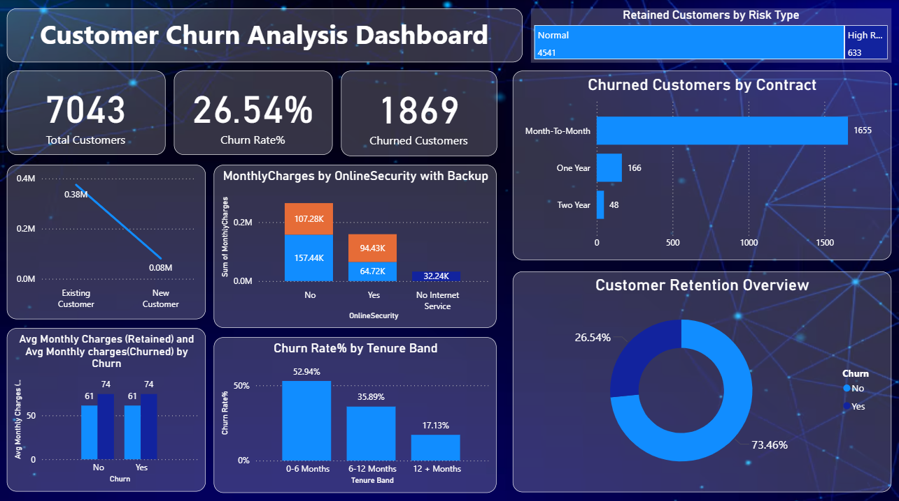

# 📊 Customer Churn Analysis Dashboard – Power BI

## 📌 Project Summary
This project presents an interactive Customer Churn Analysis Dashboard built using Power BI.  
The objective is to analyze customer behavior, identify churn patterns, and provide actionable insights to improve customer retention.

The dataset contains 7,043 telecom customers, with an overall churn rate of 26.54%.

---

## 🎯 Key Objectives
- Identify high-risk customers
- Analyze churn rate by contract type
- Study churn behavior across tenure bands
- Compare revenue contribution of retained vs churned customers
- Provide business recommendations to reduce churn

---

## 🧹 Data Preparation
The following steps were performed:
- Data cleaning and handling missing values
- Creating tenure bands (0–6, 6–12, 12+ months)
- Data modeling and relationship building
- Creating calculated columns
- Developing DAX measures for KPIs

---

## 📊 Key KPIs Created (Using DAX)
- Total Customers
- Total Churned Customers
- Churn Rate %
- Average Monthly Charges (Churned vs Retained)
- High Risk Customers Count

---

## 📈 Major Insights
- Month-to-Month contracts show the highest churn.
- Customers in the first 6 months have the highest churn rate.
- Customers without Online Security and Backup services are more likely to churn.
- Long-term contracts significantly reduce churn rate.

---

## 📊 Dashboard Preview

## 🛠 Tools & Technologies
- Power BI Desktop
- Power BI Service
- DAX (Data Analysis Expressions)
- Data Cleaning & Transformation
- Data Modeling

---

## 💡 Business Recommendations
- Encourage customers to switch to long-term contracts.
- Improve onboarding experience for new customers.
- Offer bundled services to increase retention.
- Target high-risk customers with personalized offers.

---

## 🔗 Live Dashboard
[https://app.powerbi.com/groups/me/reports/20ce98ac-972a-4254-9a46-b7e1d63361fe/af9f857f7a7d047175a7?experience=power-bi]

---

## 👩‍💻 Author
Swati Priya  
Aspiring Data Analyst | Passionate about Data Visualization & Business Intelligence
